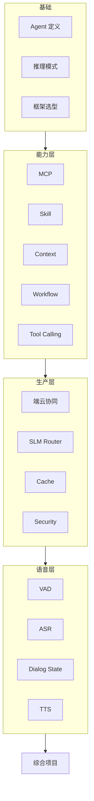

# 学习路径总览

本文档是仓库根 [README](../README.md) 的补充导航，按「概念 → 示例 → 项目」串联 18 章内容。

## 能力地图

## 每日建议节奏

1. 阅读对应章节文档（约 40–60 分钟）
2. 运行并阅读示例源码（约 30 分钟）
3. 按章节练习题改一版自己的变体（约 30–60 分钟）
4. 周末用 `projects/` 做一次整合

## 检查清单

- [ ] 能手写 ReAct 循环并解释 Observation 如何反馈 Thought
- [ ] 能画 LangGraph 风格 State + Node + Edge
- [ ] 能实现一个 MCP 风格 Tool（JSON Schema + 调用）
- [ ] 能设计 Skill 注册/发现/权限隔离
- [ ] 能实现 Sliding Window + Summary Memory
- [ ] 能按复杂度/隐私路由本地 SLM 与云端 LLM
- [ ] 能说出 Prompt Injection 防护与 Tool Sandbox 要点
- [ ] 能描述语音链路各阶段延迟与打断策略
- [ ] 完成至少一个综合项目并通过第 18 章验收标准
