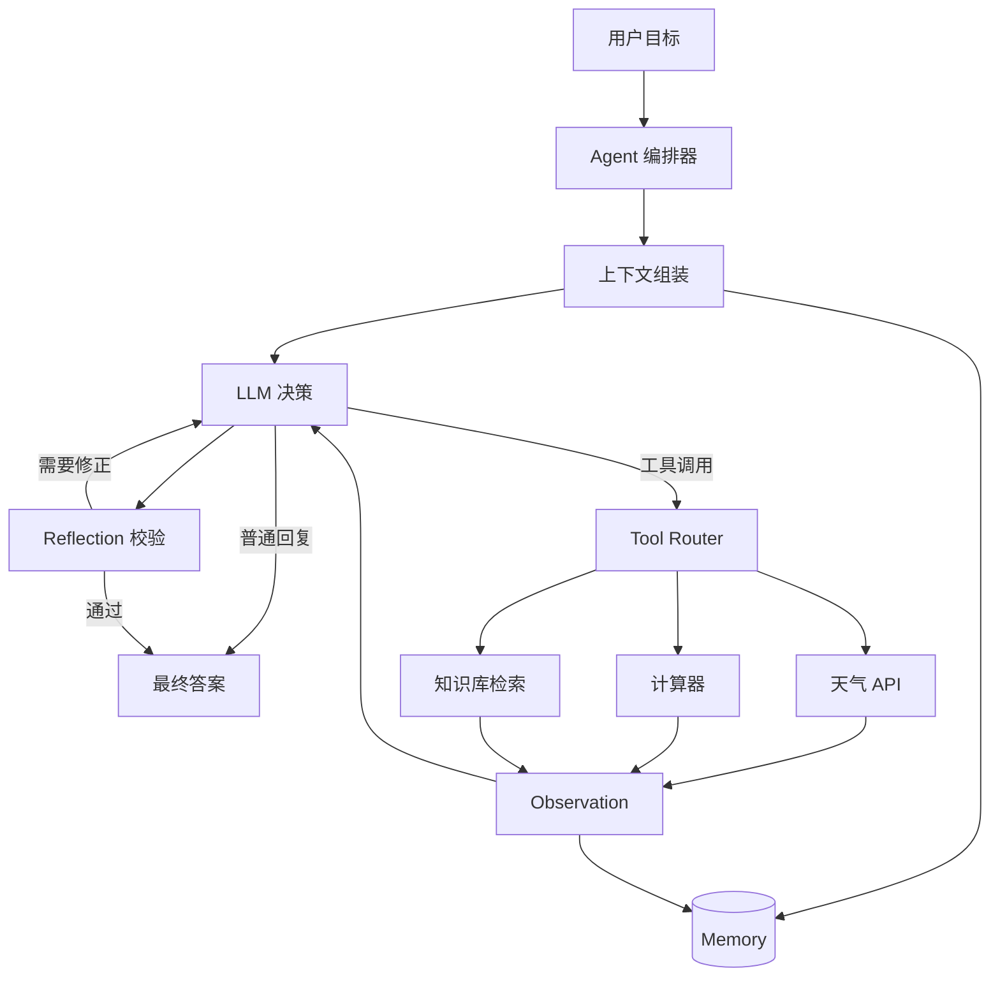
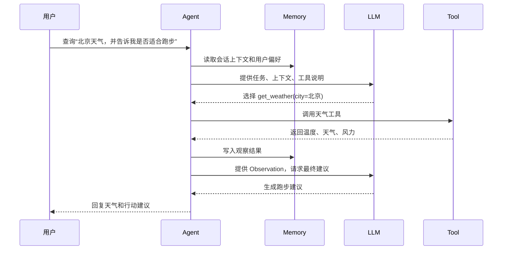

# 第 1 章：什么是 Agent

## 学习目标

本章回答三个基础问题：Agent 与普通聊天机器人有什么不同；一个可落地的 Agent 由哪些能力组成；一次任务从用户请求到最终回复通常经历哪些步骤。读完本章后，你应该能画出 Agent 的基本架构，并理解后续章节为什么要分别讨论推理模式、框架、MCP、Skill 和上下文管理。

## 1. Agent 的定义

在 AI 应用中，Agent 可以理解为「以大语言模型为决策核心，能够感知上下文、调用工具、维护状态，并围绕目标持续推进任务的软件系统」。普通聊天机器人通常只生成一段回复，而 Agent 会把用户目标拆成一系列可执行步骤：理解任务、选择工具、观察结果、更新记忆、继续规划，直到满足停止条件。

Agent 的关键不在于「模型更聪明」，而在于它把模型放进一个可控的运行闭环中。这个闭环让模型既能表达推理，又能通过工具影响外部世界，还能从结果中修正下一步行动。

## 2. Agent 的核心能力

### 2.1 LLM：推理与语言接口

LLM 负责理解自然语言、生成计划、选择工具、解释工具结果和输出最终答案。它不是整个系统的全部，而是系统中的决策引擎。工程上常见做法是为 LLM 提供系统提示词、工具描述、历史消息和外部检索结果，让它在有限上下文中做出选择。

### 2.2 Memory：记忆与状态

Memory 用来保存任务过程中的信息。短期记忆通常是当前对话、当前任务状态、工具返回值；长期记忆可以是用户偏好、历史任务记录、知识库索引。没有记忆的 Agent 只能一次性回答问题，有记忆的 Agent 才能连续完成多步任务。

### 2.3 Tool：连接外部能力

Tool 是 Agent 操作外部系统的接口，例如天气查询、数据库检索、网页浏览、代码执行、日程创建。工具应具备清晰的名称、参数、返回值和错误语义。工具越强大，越需要权限、审计和安全边界。

### 2.4 Workflow：确定性流程

Workflow 是由开发者定义的步骤和控制流，例如「先分类，再检索，再生成答案，再复核」。它降低了纯 LLM 自由决策的不确定性，是生产级 Agent 的重要组成部分。

### 2.5 Planning：计划与分解

Planning 让 Agent 把复杂目标拆成多个子任务。简单任务可以一步完成，复杂任务需要先列出计划，再逐步执行。计划不是越详细越好，关键是能降低下一步选择的难度，并允许根据观察结果调整。

### 2.6 Reflection：反思与自我校验

Reflection 是让 Agent 在生成答案或执行动作后检查质量，例如验证是否回答了问题、工具结果是否矛盾、输出是否满足格式要求。反思可以提高可靠性，但也会增加延迟和成本。

### 2.7 Multi-Agent：多 Agent 协作

Multi-Agent 是把任务分给多个角色化 Agent，例如研究员、规划员、执行员、审稿员。它适合职责分明、可以并行或互相审查的任务，但也会引入协调成本、上下文同步和冲突处理问题。

## 3. 典型架构图

这张图体现了 Agent 的闭环：LLM 不只是输出答案，也可以发起动作；工具结果会回到上下文；记忆会持续影响后续判断；反思阶段为最终输出提供质量门禁。

## 4. 一次任务的典型流程

## 5. Agent 的优点

- **更强的任务完成能力**：可以通过工具获取实时数据、执行动作，而不是只依赖模型训练知识。
- **更自然的人机接口**：用户用自然语言表达目标，系统内部再转换为结构化动作。
- **可组合**：LLM、工具、记忆、工作流可以独立演进。
- **适合复杂流程**：通过规划和反思处理多步骤任务。

## 6. Agent 的局限

- **不确定性更高**：模型可能选错工具、生成错误参数或过早结束。
- **成本与延迟增加**：多轮推理、工具调用、反思都会消耗时间和 token。
- **安全边界更复杂**：工具能改变外部状态时，需要权限、审计和人工确认。
- **调试难度更大**：失败可能来自提示词、模型、工具、上下文、网络或流程控制。

## 7. 实例讲解：天气 Agent

第一个示例 `examples/01-weather-agent` 实现一个 Function Calling 风格的天气 Agent。用户问「北京天气如何」，`MockLLM` 会根据工具说明返回 `get_weather` 调用，Agent 解析参数后调用本地 Mock 天气 API，最后组合成中文回复。

这个例子刻意保持简单：没有复杂规划，没有长期记忆，也没有真实网络请求。它的目的在于让你看到 Agent 最小闭环：用户目标进入系统，LLM 选择工具，工具返回观察结果，Agent 输出答案。

## 8. 与下一章的衔接

本章介绍了 Agent 的组成，但还没有解释 Agent 应该如何「思考」。下一章会深入三种常用推理模式：ReAct、OODA、Plan & Execute。它们决定了 Agent 在面对不确定任务时如何规划、行动、观察和调整。
