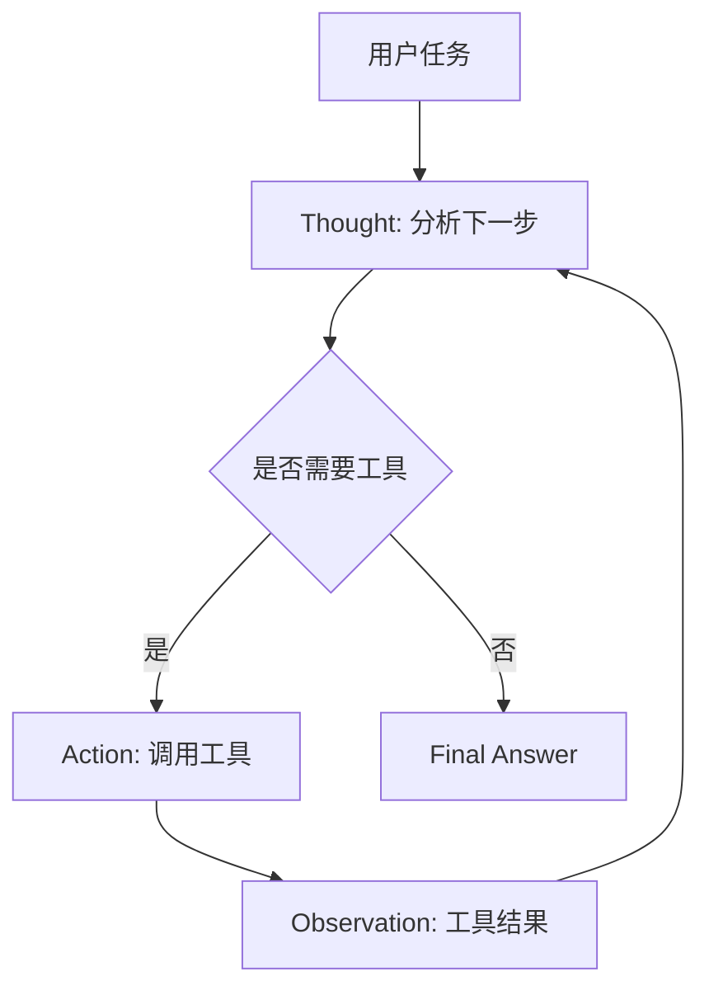
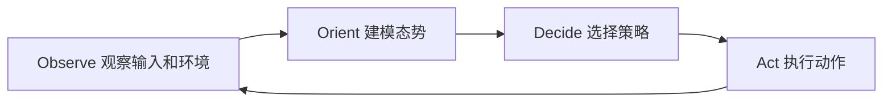
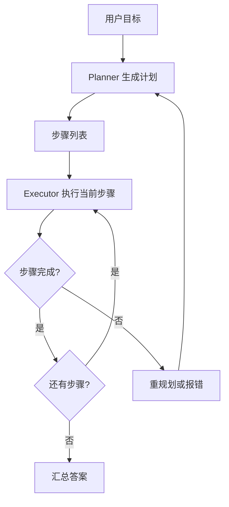

# 第 2 章：Agent 推理模式

## 学习目标

Agent 不是每一步都随意调用 LLM。为了让系统更稳定，工程上会把「思考方式」设计成明确模式。本章介绍三种常见模式：ReAct、OODA、Plan & Execute，并说明它们的流程、伪代码、适用场景和局限。

## 1. ReAct：Reasoning + Acting

ReAct 把推理和行动交替组织为 `Thought -> Action -> Observation`。模型先说明下一步想法，再选择工具；工具结果作为 Observation 回到上下文，模型基于新信息继续推理。



### 伪代码

```text
messages = [用户任务]
while not done:
    step = llm.generate(messages, format="Thought/Action")
    if step.action is None:
        return step.final_answer
    observation = call_tool(step.action.name, step.action.args)
    messages.append(step.thought)
    messages.append(observation)
```

### 适用场景

ReAct 适合工具反馈会影响下一步判断的任务，例如搜索资料、排查问题、查天气再给建议、计算中间结果。它让推理过程可观察，便于调试。

### 优点

- 推理与工具调用交替出现，符合探索型任务的节奏。
- 每次 Observation 都能修正下一步行为。
- 日志天然可读，便于定位模型在第几步偏离目标。

### 缺点

- 容易循环，需要最大步数和停止条件。
- Thought 可能泄露不适合给用户看的中间推理，生产环境常改为结构化内部日志。
- 对工具描述质量敏感，工具太多时选择难度上升。

## 2. OODA：Observe、Orient、Decide、Act

OODA 来自决策循环：观察环境、判断态势、做出决策、采取行动。与 ReAct 相比，OODA 更强调「态势评估」和持续适应，适合动态环境中的 Agent。



### 伪代码

```text
state = init_state(user_goal)
while not state.finished:
    observation = collect_signals(state)
    situation = orient(observation, memory, constraints)
    decision = decide_next_action(situation)
    result = act(decision)
    state = update_state(state, result)
```

### 适用场景

OODA 适合语音 Agent、客服 Agent、机器人控制、实时监控等场景。用户输入和环境状态会不断变化，Agent 必须快速调整策略。例如语音对话中，用户打断、沉默、改口都需要进入新一轮 OODA。

### 优点

- 强调环境变化，适合实时系统。
- 便于把感知、判断、决策和执行拆成不同模块。
- 可以自然接入规则、模型、工具和人工接管策略。

### 缺点

- 状态设计更复杂，需要定义观察信号和态势模型。
- 对延迟敏感，过多 LLM 调用会影响实时体验。
- 如果 Orient 阶段质量差，后续决策会系统性偏离。

## 3. Plan & Execute：先计划，后执行

Plan & Execute 先生成一份计划，再逐步执行计划。执行过程中可以固定计划，也可以允许在失败时重规划。



### 伪代码

```text
plan = planner(goal)
results = []
for step in plan:
    result = executor(step)
    if result.failed and can_replan:
        plan = planner(goal, completed=results, error=result)
        continue
    results.append(result)
return summarize(results)
```

### 适用场景

Plan & Execute 适合目标明确、步骤可拆分的任务，例如生成学习计划、批量处理文件、完成研究报告、执行运维流程。它让用户和系统都能提前看到任务路径。

### 优点

- 全局目标更清晰，减少走一步看一步的漂移。
- 计划可展示、可审核、可人工修改。
- 适合与工作流引擎、任务队列、审批系统结合。

### 缺点

- 初始计划可能错误，固定执行会放大错误。
- 对开放式探索任务不够灵活。
- 计划和执行分离后，需要维护步骤状态和失败恢复逻辑。

## 4. 三种模式对比

| 模式 | 核心节奏 | 最适合 | 主要风险 | 关键工程控制 |
| --- | --- | --- | --- | --- |
| ReAct | 想一步、做一步、看结果 | 工具探索、问答增强、调试 | 循环、工具误选 | 最大步数、结构化工具、日志 |
| OODA | 观察、定位、决策、行动 | 实时语音、动态客服、监控 | 延迟、状态复杂 | 事件流、状态机、超时策略 |
| Plan & Execute | 先全局计划，再逐步执行 | 长任务、批处理、报告生成 | 初始计划错误 | 可重规划、步骤状态、人工确认 |

## 5. 实例讲解：ReAct 天气与计算 Agent

示例 `examples/02-react-agent` 实现了完整 ReAct 循环。用户提出「北京天气如何，并计算 3 * 7」，Agent 会先调用天气工具获得 Observation，再调用计算器工具，最后输出综合答案。日志中会打印 Thought、Action 和 Observation，便于你观察循环如何推进。

## 6. 与下一章的衔接

推理模式解决的是「Agent 内部怎么推进任务」。当任务变复杂后，我们还需要框架来管理状态、节点、工具、多 Agent 协作和可观测性。下一章将比较 LangGraph、CrewAI、Smolagents、AutoGen 和 OpenAI Agents SDK。
