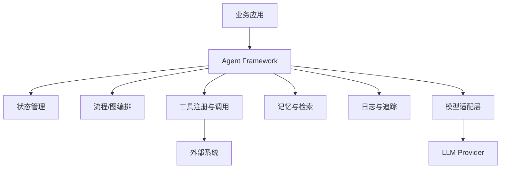
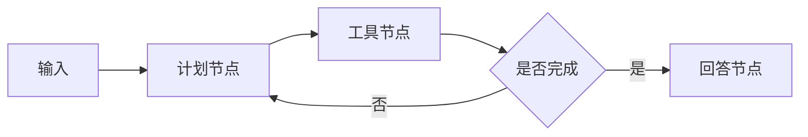
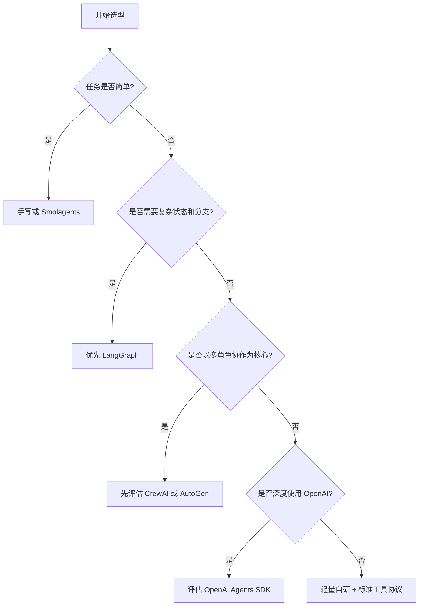

# 第 3 章：Agent 框架选型

## 学习目标

当 Agent 从演示走向生产，工程问题会迅速增加：状态如何保存，工具如何注册，节点如何编排，失败如何恢复，多 Agent 如何协作，日志如何观测。框架的价值就是把这些通用问题抽象出来。本章比较 LangGraph、CrewAI、Smolagents、AutoGen 和 OpenAI Agents SDK，并给出选型建议。

## 1. 为什么需要框架

手写 Agent 很适合理解原理，但复杂任务会遇到以下问题：

- 状态散落在变量和消息列表中，难以恢复和调试。
- 工具调用缺少统一 schema、权限和错误处理。
- 多步骤流程需要条件分支、循环、并发和重试。
- 多 Agent 对话需要角色、消息路由和终止条件。
- 生产系统需要日志、追踪、评估和版本管理。

框架不能替代业务设计，但能提供稳定的执行模型。

## 2. 框架通用架构

## 3. 主流框架对比

| 框架 | 核心思想 | 优点 | 局限 | 适合场景 |
| --- | --- | --- | --- | --- |
| LangGraph | 用图结构表达 Agent 状态机 | 状态控制强、循环和分支清晰、适合生产流程 | 学习曲线高，需要理解图和状态设计 | 复杂工作流、需要可恢复状态的 Agent |
| CrewAI | 角色化多 Agent 协作 | 上手快，角色、任务、团队概念直观 | 对底层状态机控制较弱，复杂流程需要额外约束 | 内容生产、研究报告、多角色协作 |
| Smolagents | 轻量、代码优先的 Agent | 简洁、易读、适合教学和原型 | 生态和生产配套相对少 | 小型工具 Agent、快速实验 |
| AutoGen | 多 Agent 对话与协作 | 对话式协作能力强，适合模拟团队讨论 | 对话轮次和终止条件需要谨慎控制 | 多角色讨论、代码协作、研究实验 |
| OpenAI Agents SDK | OpenAI 官方 Agent 抽象 | 与 OpenAI 模型、工具调用、追踪集成紧密 | 生态绑定更强，跨模型灵活性取决于适配 | 使用 OpenAI 技术栈的产品 Agent |

## 4. LangGraph：图即状态机

LangGraph 的核心是把 Agent 拆成节点和边。每个节点读取状态、产生状态更新；边决定下一步去哪。它适合需要循环、条件分支、人工审核和持久化的生产 Agent。

优点是控制流清晰，缺点是前期设计成本较高。示例 `examples/03-langgraph-mini` 会用纯 Python 自实现一个极简图状态机，帮助你理解 LangGraph 思想而不依赖第三方包。

## 5. CrewAI：角色和任务

CrewAI 更关注团队协作建模。你可以定义 researcher、writer、reviewer 等角色，再把任务分配给这些角色。它很适合内容生成、竞品研究、资料整理等职责可拆分的任务。

它的风险在于「角色对话看起来合理」不等于结果可靠。生产使用时仍然需要明确输入输出、评价标准、最大轮次和人工审核。

## 6. Smolagents：小而透明

Smolagents 强调轻量和可读，适合教学、快速原型和小型工具 Agent。它提醒我们：不是所有项目都需要重型框架。对于单工具或少量步骤的 Agent，简单代码往往更容易维护。

局限是当你需要复杂状态恢复、分布式执行或企业级观测时，可能需要补充更多基础设施。

## 7. AutoGen：对话式多 Agent

AutoGen 擅长让多个 Agent 通过对话协作。它适合需要不同角色互相提问、审查和迭代的场景，例如代码生成与审阅、研究讨论、方案评审。

使用 AutoGen 时要重点设计终止条件。没有清晰停止规则，多 Agent 很容易持续对话、消耗成本，却没有稳定产出。

## 8. OpenAI Agents SDK：官方集成路径

OpenAI Agents SDK 提供 Agent、工具、handoff、追踪等抽象，适合已经使用 OpenAI 模型和工具调用能力的团队。它的优势是与官方 API 演进同步，工程集成路径清晰。

如果团队希望模型供应商中立，或已经有自研工具协议和编排层，则需要评估其绑定成本。

## 9. 选型建议

实践中可以先从手写最小 Agent 开始，明确状态和工具边界后再引入框架。框架迁移的最佳时机通常是：你已经能描述清楚节点、状态、工具、失败恢复和观测需求。

## 10. 与下一章的衔接

框架解决 Agent 内部编排问题，但工具和外部资源仍然需要统一接入方式。下一章将介绍 MCP：它试图为模型应用和外部能力之间提供标准协议层。
