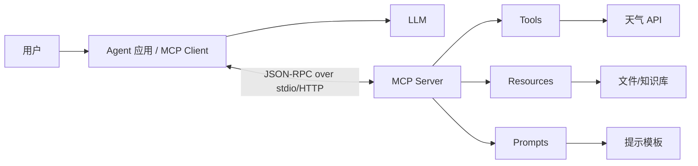
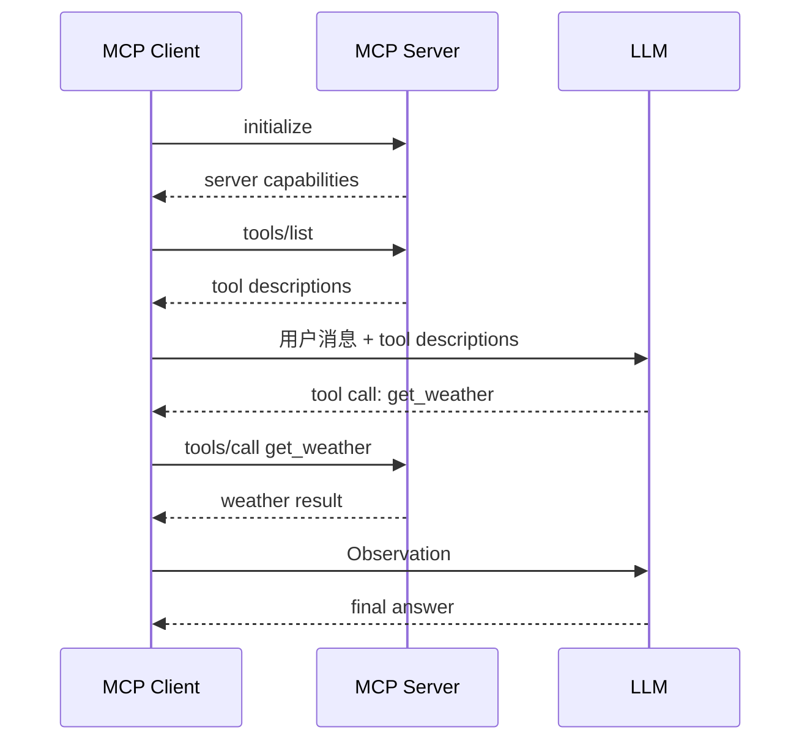

# 第 4 章：MCP 协议入门

## 学习目标

MCP（Model Context Protocol）是一种连接模型应用与外部上下文能力的协议思路。它让工具、资源和提示模板以统一方式暴露给客户端，从而减少每个 Agent 框架重复适配外部系统的成本。本章介绍 MCP Client、Server、Tool、Resource、Prompt 的概念，以及协议优势和典型应用。

## 1. MCP 要解决什么问题

没有统一协议时，每个应用都要为数据库、文件系统、GitHub、浏览器、内部服务分别写集成代码。工具参数格式、鉴权方式、错误返回、资源读取方式各不相同，导致复用困难。

MCP 的思路是把外部能力放到 MCP Server 中，由 MCP Client 发现和调用。Agent 框架只需要理解 MCP 的通用接口，就能连接不同 Server。

## 2. 核心角色

### 2.1 MCP Client

MCP Client 通常嵌在模型应用或 Agent 框架中。它负责启动或连接 MCP Server，发现可用能力，把能力描述提供给模型，并把模型产生的调用请求转发给 Server。

### 2.2 MCP Server

MCP Server 是外部能力提供者。它可以连接本地文件、数据库、HTTP API、内部业务系统或开发工具。Server 负责声明自己提供哪些 Tool、Resource 和 Prompt，并执行具体操作。

### 2.3 Tool

Tool 是可执行动作，例如 `get_weather`、`search_docs`、`create_ticket`。Tool 通常包含名称、描述、输入 schema 和返回结果。Agent 通过 Tool 改变或查询外部世界。

### 2.4 Resource

Resource 是可读取的上下文，例如文件内容、数据库记录、网页片段、配置项。与 Tool 相比，Resource 更偏数据访问，通常不产生副作用。

### 2.5 Prompt

Prompt 是可复用提示模板，例如「代码审查模板」「客户支持回复模板」。Server 暴露 Prompt 后，Client 可以按名称获取模板并填充参数。

## 3. 典型通信结构

很多 MCP 实现使用 JSON-RPC 作为消息格式，并通过 stdio 或 HTTP/SSE 等传输方式通信。学习阶段可以先理解「Client 发送方法名和参数，Server 返回结构化结果」这一核心。

## 4. MCP 调用流程

## 5. 协议优势

- **解耦模型应用和外部系统**：Agent 不需要知道每个工具的底层实现。
- **复用能力**：一个 MCP Server 可以被多个客户端和框架使用。
- **统一发现机制**：Client 可以列出可用 Tool、Resource、Prompt。
- **更容易治理**：工具权限、日志、错误格式可以集中在 Server 侧处理。
- **便于本地开发**：stdio Server 可以像命令行程序一样启动，适合开发者工具场景。

## 6. 协议局限与注意事项

- MCP 统一了接口，但不自动解决权限、安全和审计问题。
- Tool schema 设计不好，模型仍然会传错参数。
- Server 数量增加后，需要管理版本、兼容性和信任边界。
- 长耗时工具要设计超时、取消和进度反馈。
- 对有副作用的工具，应加入确认机制或权限分层。

## 7. 典型应用

1. **开发者助手**：读取代码、搜索仓库、运行测试、查询 issue。
2. **企业知识库**：将文档、工单、CRM 数据以 Resource 或 Tool 暴露。
3. **数据分析 Agent**：连接数据库、指标平台、报表系统。
4. **个人效率工具**：日历、邮件、待办、笔记。
5. **语音 Agent**：把实时业务动作封装为工具，例如查询订单、创建工单。

## 8. 实例讲解：简化 MCP 天气 Server

示例 `examples/04-mcp-server` 实现了一个最小 MCP 风格 JSON-RPC over stdio 服务。`server.py` 支持 `initialize`、`tools/list`、`tools/call`；`client_demo.py` 启动子进程，通过标准输入输出发送 JSON-RPC 请求，调用天气工具。

它不是完整 MCP SDK，但保留了最重要的协议思想：能力发现与结构化调用分离，Client 不直接依赖天气工具实现。

## 9. 与下一章的衔接

MCP 关注「工具和资源如何标准化接入」。但在 Agent 产品中，我们还常常需要更高层的能力封装：一组提示、工具、流程、评估和使用说明组合成可复用技能。下一章将介绍 Skill System。
