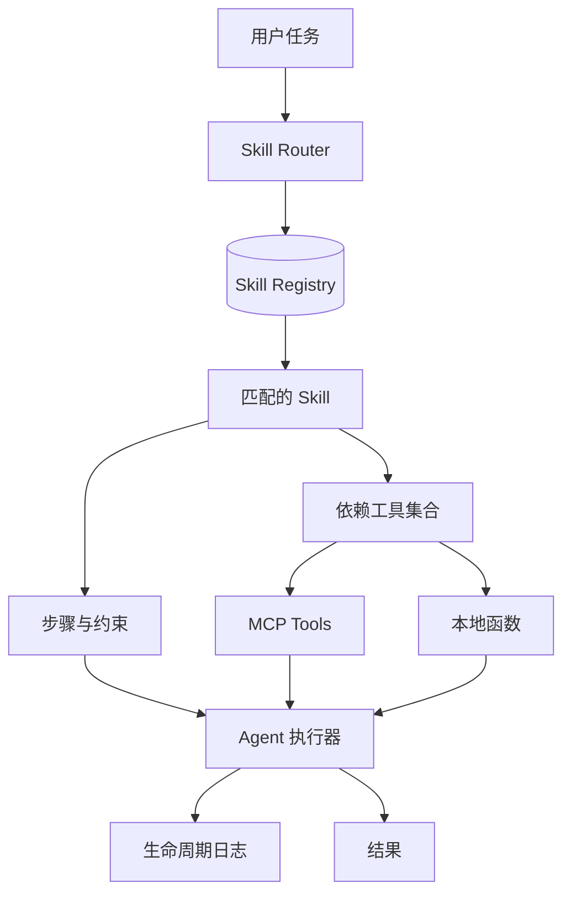
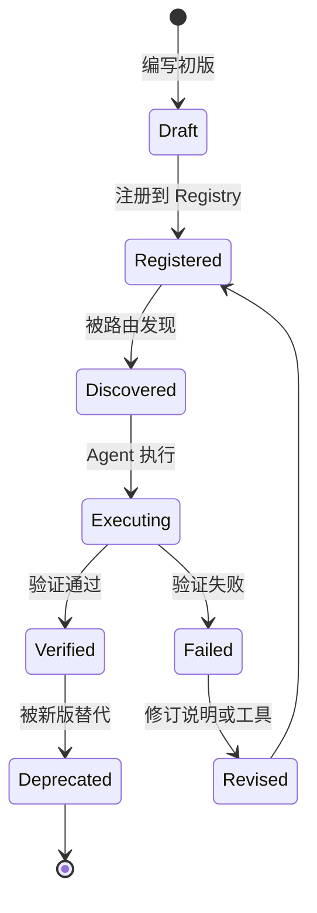

# 第 5 章：Skill System 技能体系

## 学习目标

Skill 是把某类任务的知识、工具、流程和约束封装成可复用能力单元的方式。它比单个 Tool 更高层，也比完整 Agent 更轻量。本章介绍 Skill 的定义、设计原则、生命周期，以及 Skill 与 MCP Tool 的关系。

## 1. 什么是 Skill

Skill 可以理解为「可被 Agent 发现、理解并调用的一组任务能力」。一个 Skill 通常包含：

- 适用场景：什么时候应该使用它。
- 操作说明：执行任务的步骤和注意事项。
- 依赖工具：需要哪些 Tool、API 或文件。
- 输入输出约定：用户需要提供什么，Skill 产出什么。
- 验证方式：如何确认任务完成。

例如「代码审查 Skill」可能包含检查清单、风险优先级、输出格式和相关命令；「客服退款 Skill」可能包含政策规则、订单查询工具、审批条件和回复模板。

## 2. Skill 与 Tool 的区别

| 维度 | Skill | Tool |
| --- | --- | --- |
| 抽象层级 | 高层任务能力 | 低层可执行函数 |
| 内容 | 说明、流程、策略、工具组合 | 名称、参数、执行结果 |
| 是否一定执行代码 | 不一定，可能只是指导 Agent | 通常会执行代码或外部调用 |
| 适合表达 | “如何完成代码审查” | “读取文件”“创建工单” |
| 与 MCP 的关系 | 可引用 MCP Tool | 可通过 MCP 暴露 |

简单说：Tool 是手，Skill 是做事的方法。

## 3. Skill 架构

Skill Registry 负责注册、发现和选择 Skill。Agent 执行器读取 Skill 的说明后，再按步骤调用工具、记录日志和生成结果。

## 4. 设计原则

### 4.1 单一职责

一个 Skill 应该服务一个清晰任务。不要把「写代码、跑测试、发 PR、写发布公告」混在一个 Skill 中，除非它们本来就是一个稳定流程。

### 4.2 触发条件明确

Skill 要说明什么时候适用，什么时候不适用。触发条件越清晰，Agent 越不容易误用。

### 4.3 输入输出结构化

输入可以是自然语言，但内部应尽量转成结构化字段，例如目标、约束、资源路径、验收标准。输出也应有固定格式，便于后续工作流消费。

### 4.4 依赖显式

Skill 使用哪些工具、需要哪些权限、会读写哪些数据，都应明确写出。隐式依赖会让复用和审计变困难。

### 4.5 可验证

每个 Skill 都应说明完成标准。例如「示例可运行且无异常」「输出包含风险分级」「工单状态变为 submitted」。没有验证标准的 Skill 容易变成泛泛建议。

## 5. Skill 生命周期

### 阶段说明

1. **Draft**：写出 Skill 名称、描述、步骤和依赖。
2. **Registered**：加入注册表，能被发现。
3. **Discovered**：根据用户任务匹配到 Skill。
4. **Executing**：Agent 按 Skill 指导执行。
5. **Verified**：运行验证命令、检查输出或人工审核。
6. **Revised**：根据失败日志改进 Skill。
7. **Deprecated**：旧 Skill 被新版本替代。

## 6. Skill 与 MCP Tool 如何配合

MCP Tool 提供标准化工具接口，Skill 则定义如何组合这些工具完成任务。例如：

- MCP Tool：`github.get_pull_request`、`filesystem.read_file`、`test.run_command`
- Skill：代码审查流程，规定先读取 diff，再检查风险，再运行测试，最后按严重程度输出发现

这种分层可以让工具保持通用，让 Skill 承载业务知识和最佳实践。

## 7. 优点

- **复用经验**：把专家流程写成可调用能力。
- **降低提示词重复**：常用任务不需要每次重新解释。
- **更容易治理**：Skill 可以版本化、审查和废弃。
- **适合团队协作**：不同团队可以维护自己的 Skill。

## 8. 局限

- Skill 写得太泛会难以触发和验证。
- Skill 过多会带来路由和冲突问题。
- 如果依赖工具不稳定，Skill 质量也会下降。
- Skill 需要持续维护，否则会与业务流程脱节。

## 9. 实例讲解：Skill Registry

示例 `examples/05-skill-registry` 实现一个本地 Skill 注册表。程序会注册天气说明、计算、总结三个 Skill，根据用户任务关键词发现候选 Skill，调用对应处理函数，并记录 `registered -> discovered -> invoked -> completed` 生命周期日志。

这个示例展示了 Skill 不一定需要复杂框架。只要有清晰元数据、匹配规则、调用接口和日志，就能形成最小可用 Skill System。

## 10. 与下一章的衔接

Skill 告诉 Agent 如何做事，但 Agent 做事时还必须面对上下文限制：历史消息放不下、长期知识需要检索、重复信息需要缓存。下一章将讨论上下文管理和记忆策略。
