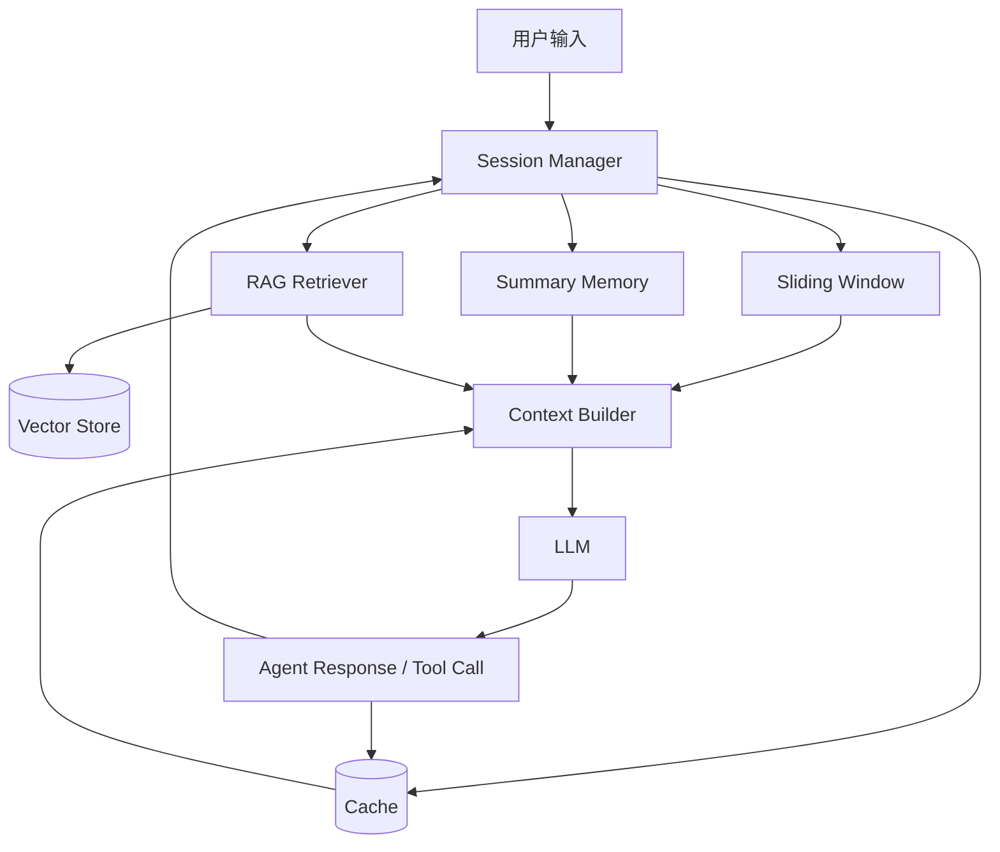
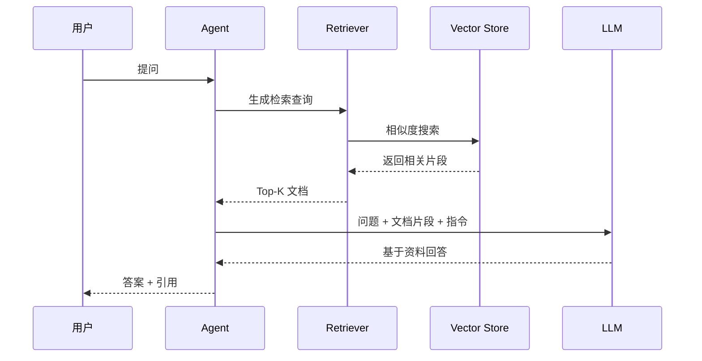

# 第 6 章：上下文管理与记忆

## 学习目标

LLM 的上下文窗口有限，而 Agent 任务往往需要持续多轮对话、调用多个工具、读取大量资料。上下文管理的目标是：在有限 token 内放入最有用的信息，并让 Agent 在需要时找回历史知识。本章介绍 Short Memory、Long Memory、RAG、Session、Sliding Window、Summary、Vector 和 Cache。

## 1. 为什么上下文管理重要

一个 Agent 的表现很大程度取决于它看到什么。上下文太少，Agent 会忘记用户目标和约束；上下文太多，成本升高、延迟变大，模型还可能被无关信息干扰。

语音 Agent 中上下文管理更关键。用户可能频繁打断、改口、补充信息，系统既要保留当前意图，又不能把所有语音转写逐字塞进模型。

## 2. 记忆类型

### 2.1 Short Memory：短期记忆

短期记忆保存当前会话和当前任务状态，例如最近几轮对话、当前计划、工具 Observation。它通常存放在内存或会话状态中，生命周期较短。

### 2.2 Long Memory：长期记忆

长期记忆保存跨会话信息，例如用户偏好、历史订单、项目背景、知识库文档。它通常需要数据库、向量库或文件系统支持，并要考虑隐私、过期和用户可控删除。

### 2.3 Session：会话状态

Session 是一次交互过程的容器。它把用户身份、当前任务、短期记忆、临时变量和工具结果绑定在一起。良好的 Session 设计能让 Agent 在多轮任务中保持一致。

## 3. 常见上下文策略

### 3.1 Sliding Window

Sliding Window 只保留最近 N 条消息。它简单、稳定、成本可控，适合短对话和局部相关性强的任务。

缺点是会忘记较早约束。例如用户第一轮说「只用中文回答」，窗口滑动后模型可能忘记。

### 3.2 Summary Memory

Summary Memory 把较早消息压缩成摘要，再与最近消息一起提供给模型。它适合长对话，但摘要质量决定了记忆质量。

### 3.3 Vector Memory

Vector Memory 把历史片段或文档转成向量，按语义相似度检索相关内容。它适合知识库问答、跨会话记忆、项目资料检索。

### 3.4 Cache

Cache 缓存高频查询、工具结果或模型输出。例如天气、用户资料、常用文档片段。缓存能降低延迟和成本，但要设置过期时间，避免返回过时信息。

### 3.5 RAG：检索增强生成

RAG（Retrieval-Augmented Generation）是先从外部知识库检索相关内容，再把检索结果放入上下文生成答案。它解决模型知识过时和私有知识不可见的问题。

## 4. 上下文管理架构

Context Builder 是关键组件。它决定每次调用 LLM 时放入哪些系统提示、用户消息、摘要、检索片段、工具结果和约束。

## 5. RAG 流程

## 6. 策略对比

| 策略 | 优点 | 缺点 | 适用场景 |
| --- | --- | --- | --- |
| Sliding Window | 简单、稳定、便宜 | 容易忘记早期信息 | 短对话、实时语音 |
| Summary Memory | 能压缩长历史 | 摘要可能丢细节 | 长对话、客服记录 |
| Vector Memory | 可按语义找回历史 | 需要切分、嵌入、索引 | 知识库、跨会话记忆 |
| Cache | 降低延迟和成本 | 需要过期和一致性策略 | 高频工具调用、固定资料 |
| RAG | 引入外部知识 | 检索质量影响答案 | 私有文档问答、专业知识 |

## 7. 工程实践建议

1. **先定义上下文预算**：明确系统提示、工具说明、历史、检索结果各占多少 token。
2. **保留不可丢失约束**：用户偏好、安全规则、输出格式应放在稳定位置，而不是普通历史消息。
3. **摘要要可追溯**：重要决策和事实最好保留原始来源引用。
4. **检索结果要排序和去重**：避免把重复片段浪费在上下文窗口中。
5. **缓存要有过期策略**：天气、价格、库存等实时信息不能永久缓存。
6. **对隐私敏感信息分级**：长期记忆应允许用户查看、修改和删除。

## 8. 实例讲解：Sliding Window + Summary Memory

示例 `examples/06-context-memory` 实现一个本地会话记忆。程序会模拟多轮对话，只把最近三轮放入窗口，把更早内容压缩成摘要。每轮都会打印当前 Summary 和 Window，让你看到上下文如何在不无限增长的情况下保留关键信息。

## 9. 与后续学习的衔接

到本章为止，你已经掌握了 Agent 基础、推理模式、框架、MCP、Skill 和上下文管理。后续可以继续学习工作流编排、工具调用细节、小模型路由、缓存、安全治理和语音流水线。语音 Agent 尤其需要把 OODA、MCP Tool、Skill 和上下文管理组合起来，才能在低延迟、多轮打断和真实业务动作之间取得平衡。
