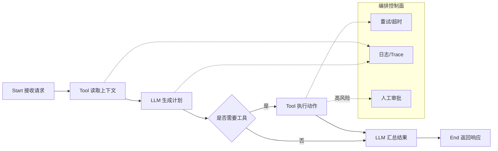

# 第 7 章：Workflow 编排

本章讨论 AI Agent 系统中的 Workflow 编排。Workflow 不是简单地把几个函数串起来，而是把「输入、状态、工具调用、模型推理、人工审批、重试、审计」组织成可观察、可恢复、可扩展的执行过程。

## 1. 概念讲解

在早期 Agent 原型中，我们常见的写法是：

1. 接收用户输入。
2. 调用 LLM 生成计划。
3. 调用工具。
4. 把工具结果再交给 LLM。
5. 返回最终答案。

这种写法适合 Demo，但进入生产环境后会遇到问题：

- 某一步失败后如何重试？
- 执行到一半服务重启后如何恢复？
- 多个工具调用能否并行？
- 是否需要人工审批高风险动作？
- 如何审计每一步输入、输出和耗时？
- 如何限制循环次数，避免 Agent 失控？

Workflow 编排的核心目标是把 Agent 的执行过程显式化。它通常由以下元素组成：

- **节点（Node）**：一个可执行单元，例如工具调用、LLM 调用、数据转换、审批。
- **边（Edge）**：节点之间的流转关系，可以是线性的，也可以是条件分支。
- **状态（State）**：贯穿整个流程的上下文，例如用户请求、工具结果、模型输出、错误信息。
- **控制策略**：重试、超时、并发、补偿、人工介入、幂等。
- **可观测性**：日志、Trace、指标、审计事件。

## 2. Mermaid 架构图



## 3. LangGraph / Temporal / Airflow / Dify / n8n 对比

| 工具 | 主要定位 | 优势 | 局限 | 适合场景 |
| --- | --- | --- | --- | --- |
| LangGraph | LLM Agent 状态图 | 与 LLM/Tool/Memory 结合紧密，适合循环和条件路由 | 需要开发者理解状态建模 | Agent 推理、多步工具调用、RAG Agent |
| Temporal | 通用可靠工作流引擎 | 持久化、重试、补偿、长事务能力强 | 学习成本较高，部署较重 | 企业级长流程、支付、审批、跨系统任务 |
| Airflow | 数据工作流调度 | DAG、周期任务、数据平台生态成熟 | 不适合低延迟交互式 Agent | ETL、离线任务、批处理模型评估 |
| Dify | 低代码 LLM 应用平台 | 快速搭建 LLM 工作流和应用 | 深度定制受平台边界影响 | 业务团队快速验证、内部 AI 应用 |
| n8n | 通用自动化编排 | 连接器丰富，可视化强 | 复杂 Agent 状态管理较弱 | SaaS 集成、通知、轻量自动化 |

一个常见判断方法：

- 如果核心问题是 **Agent 推理状态**，优先考虑 LangGraph。
- 如果核心问题是 **可靠执行与恢复**，优先考虑 Temporal。
- 如果核心问题是 **离线数据 DAG**，优先考虑 Airflow。
- 如果核心问题是 **低代码快速交付**，优先考虑 Dify 或 n8n。

## 4. 企业编排模式

### 4.1 线性流水线

最简单的模式是固定顺序：

```text
Start -> 输入校验 -> 检索上下文 -> LLM -> 工具 -> LLM -> End
```

适合客服问答、摘要生成、报告生成等可预测流程。

### 4.2 条件分支

根据状态决定下一步：

- 请求包含敏感信息：走本地模型或脱敏节点。
- 工具动作风险高：进入人工审批。
- 模型置信度低：转人工或升级大模型。

### 4.3 循环规划

Agent 可能需要多轮「思考 -> 调工具 -> 观察结果」：

```text
Plan -> Act -> Observe -> Plan
```

生产环境必须设置最大循环次数、工具白名单和预算上限。

### 4.4 Saga 补偿

对于跨系统写操作，需要补偿动作。例如：

1. 创建工单。
2. 扣减库存。
3. 发送通知。

如果第 3 步失败，可能需要取消工单或恢复库存。Temporal 非常适合这类长事务。

### 4.5 Human-in-the-loop

高风险动作不应由 Agent 直接执行，例如：

- 删除生产数据。
- 发起付款。
- 修改客户合同。
- 向外部用户发送正式邮件。

Workflow 中可以插入人工审批节点，审批通过后才继续执行。

## 5. 设计要点

1. **显式状态模型**：不要把关键上下文藏在局部变量里，应放入可序列化状态。
2. **节点职责单一**：每个节点只做一类事情，便于测试和替换。
3. **幂等工具调用**：失败重试时不能造成重复扣款、重复发信等副作用。
4. **边界可恢复**：长流程应在关键节点后保存状态。
5. **统一错误结构**：区分可重试错误、业务拒绝、权限错误和系统故障。
6. **可观测性内建**：每个节点记录输入摘要、输出摘要、耗时和调用结果。
7. **安全策略前置**：权限、预算、速率限制应在执行动作前检查。

## 6. 代码实例说明

配套示例位于：

```text
examples/07-workflow/main.py
```

示例实现了一个简易线性编排器：

```text
Start -> Tool -> LLM -> Tool -> End
```

它包含：

- `WorkflowContext`：保存工作流状态。
- `Step`：定义节点名称和处理函数。
- `WorkflowEngine`：按顺序执行节点，并记录时间线。
- Mock LLM：本地规则生成计划，无需 API Key。
- 真实 API 开关：通过环境变量预留接入点，默认不启用。

运行方式：

```bash
cd examples/07-workflow
python main.py
```

## 7. 练习题

1. 给示例增加一个条件分支：当请求包含「删除」时进入人工审批节点。
2. 为每个节点增加 `timeout_seconds` 配置，并在超时时返回结构化错误。
3. 把工作流状态保存成 JSON 文件，使流程失败后可以从最近节点恢复。
4. 给工具节点增加最多 2 次重试，并记录每次重试的原因。
5. 思考：为什么 Agent 循环必须设置最大步数和预算上限？
