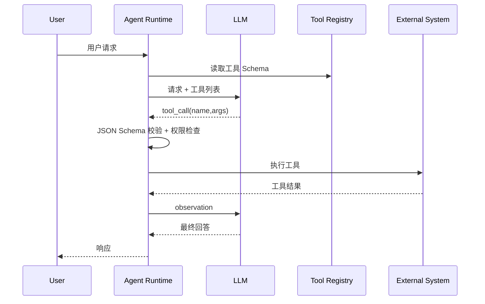
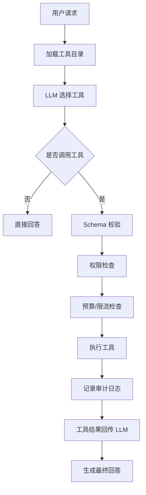

# 第 8 章：Tool Calling

Tool Calling 是 AI Agent 从「会说话」走向「会做事」的关键机制。模型负责理解意图和选择动作，工具负责访问真实世界：查询数据库、调用 REST API、执行 Python 函数、读写文件、检索知识库或触发业务系统。

## 1. 概念讲解

一个完整的 Tool Calling 闭环通常包含：

1. **工具注册**：向模型或编排器声明工具名称、描述和参数 Schema。
2. **模型决策**：模型根据用户请求选择是否调用工具，以及调用哪个工具。
3. **参数生成**：模型生成符合 Schema 的 JSON 参数。
4. **参数校验**：运行时检查类型、必填字段、枚举值和权限。
5. **工具执行**：调用 Python 函数、REST API、数据库或 MCP 工具。
6. **结果回传**：把工具结果作为 observation 交回模型。
7. **最终回答**：模型基于工具结果生成面向用户的响应。

关键点是：模型不应直接执行动作，它只提出结构化调用请求；运行时负责校验、授权、执行和审计。

## 2. Mermaid 架构图



## 3. OpenAI / Claude / Gemini / MCP / REST / Python / DB Tool

### 3.1 OpenAI Function Calling

OpenAI 的工具调用通常使用 JSON Schema 描述函数参数。模型输出 `tool_calls`，运行时执行后把结果作为 tool message 送回模型。

适合：

- 多工具选择。
- 结构化参数生成。
- 与 OpenAI Chat Completions 或 Responses API 集成。

### 3.2 Claude Tool Use

Claude 使用 `tool_use` 和 `tool_result` 消息块。它强调工具结果作为上下文的一部分继续推理。

适合：

- 长上下文分析。
- 对工具结果进行解释和归纳。
- 需要较强文本推理的场景。

### 3.3 Gemini Function Calling

Gemini 支持函数声明和函数调用结果回传，常用于 Google 生态集成。

适合：

- Google Cloud / Workspace 集成。
- 多模态输入下的函数调用。

### 3.4 MCP Tool

MCP（Model Context Protocol）把工具、资源和提示模板封装为标准协议。Agent 不需要为每个工具写独立适配层，可以通过 MCP Server 发现并调用工具。

适合：

- IDE、知识库、数据库、浏览器等外部能力接入。
- 多 Agent 或多客户端共享工具定义。
- 工具权限和上下文边界统一管理。

### 3.5 REST Tool

REST Tool 把 HTTP API 包装为工具，例如：

- 查询订单。
- 创建工单。
- 调用搜索服务。
- 触发 CI/CD。

设计重点是超时、重试、鉴权、幂等键和错误映射。

### 3.6 Python Tool

Python Tool 是最轻量的本地工具形式，适合：

- 数据清洗。
- 规则判断。
- 文件转换。
- 调用内部 SDK。

生产环境中应限制可调用函数，禁止让模型生成任意 Python 代码后直接执行。

### 3.7 DB Tool

数据库工具常见于 BI Agent 和运营分析 Agent。建议提供受控查询接口，而不是让模型直接执行任意 SQL：

- 只读账号。
- 表和字段白名单。
- 查询超时。
- 行数限制。
- SQL 审计。
- 敏感字段脱敏。

## 4. JSON Schema 设计

一个好的工具 Schema 应满足：

1. **名称明确**：例如 `get_weather` 比 `call_api` 更清晰。
2. **描述包含使用边界**：说明何时使用、何时不要使用。
3. **参数类型精确**：字符串、数字、布尔、数组、对象不要混用。
4. **必填字段最小化**：只把真正必需的字段放入 `required`。
5. **枚举约束明确**：例如单位只能是 `celsius` 或 `fahrenheit`。
6. **避免危险自由文本**：对 SQL、Shell、URL 等高风险输入增加白名单。
7. **返回结果结构稳定**：工具结果也应尽量结构化，方便模型继续推理。

示例：

```json
{
  "name": "get_weather",
  "description": "查询指定城市的当前天气。只用于天气相关问题。",
  "parameters": {
    "type": "object",
    "properties": {
      "city": {
        "type": "string",
        "description": "城市名称，例如 Beijing"
      },
      "unit": {
        "type": "string",
        "enum": ["celsius", "fahrenheit"],
        "description": "温度单位"
      }
    },
    "required": ["city"]
  }
}
```

## 5. 调用闭环设计

生产级 Tool Calling 不只是「模型想调什么就调什么」。建议实现以下闭环：



其中最容易被忽略的是：

- **Schema 校验失败时不要执行工具**。
- **权限检查失败时要返回可解释错误**。
- **工具结果应进行输出过滤**，避免泄露内部字段。
- **审计日志要记录调用者、工具、参数摘要、结果状态和耗时**。

## 6. 设计要点

1. **工具注册表是安全边界**：只有注册过的工具可调用。
2. **参数校验在模型输出之后、执行之前**：不能信任模型生成的 JSON。
3. **工具错误要结构化**：区分用户输入错误、权限错误、外部系统错误。
4. **结果最小化**：只返回模型完成任务所需的信息。
5. **高风险工具需要审批**：写操作、删除操作、付款操作应额外保护。
6. **调用次数有限制**：避免模型陷入工具调用循环。

## 7. 代码实例说明

配套示例位于：

```text
examples/08-tool-calling/main.py
```

示例包含：

- JSON Schema 风格的工具注册。
- 简易参数校验器。
- Mock LLM 根据用户问题选择工具。
- 工具执行后把结果交回 Mock LLM 生成最终回答。
- 真实模型开关说明，默认不需要 API Key。

运行方式：

```bash
cd examples/08-tool-calling
python main.py
```

## 8. 练习题

1. 给示例增加 `search_order` 工具，参数包含 `order_id`。
2. 把工具调用结果写入审计日志文件。
3. 增加一个权限系统：普通用户不能调用写操作工具。
4. 为参数 Schema 增加 `enum` 校验。
5. 思考：为什么不应该让模型直接生成 SQL 后执行？
