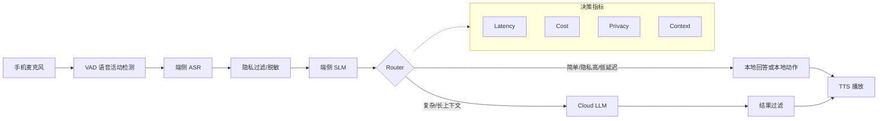

# 第 9 章：端云协同架构

端云协同是语音 Agent 和移动端 AI 应用的重要架构。它把一部分能力放在设备端执行，例如唤醒词、语音活动检测、轻量意图识别和隐私过滤；把复杂推理、长上下文和高质量生成交给云端大模型。

## 1. 概念讲解

在语音 Agent 中，用户期待系统具备低延迟、低成本、保护隐私和高质量回答。单纯依赖云端 LLM 会带来几个问题：

- 每次请求都上云，网络延迟不可控。
- 高频短指令消耗大量 Token，成本高。
- 原始语音和隐私文本上传云端，合规压力大。
- 弱网或离线场景体验差。

端云协同的思路是：在端侧先完成低成本、低风险、低延迟的任务，只把需要强推理能力的请求交给云端。

典型链路：

```text
手机麦克风 -> VAD -> ASR -> 本地 SLM -> Router -> 云端 LLM -> TTS -> 播放
```

其中：

- **VAD**：Voice Activity Detection，判断用户是否在说话。
- **ASR**：Automatic Speech Recognition，把语音转文字。
- **SLM**：Small Language Model，小模型，适合端侧快速判断和简单回答。
- **Router**：路由器，根据复杂度、隐私、成本和延迟选择执行位置。
- **Cloud LLM**：云端大模型，处理复杂任务和长上下文任务。
- **TTS**：Text To Speech，把文本转成语音。

## 2. Mermaid 架构图



## 3. 手机 -> SLM -> Router -> Cloud LLM

### 3.1 手机端

手机端负责最靠近用户的交互：

- 唤醒词检测。
- 语音活动检测。
- 本地 ASR 或流式 ASR 前处理。
- 噪声抑制。
- 本地缓存。
- 隐私字段识别。

手机端越早过滤无效输入，云端成本越低。

### 3.2 本地 SLM

SLM 的职责不是替代大模型，而是承担「足够简单」的任务：

- 开关设备。
- 设置闹钟。
- 播放音乐。
- 查询本地日程。
- 判断请求是否包含敏感信息。
- 给 Router 生成复杂度评分。

SLM 的优势是低延迟、低成本和隐私友好；劣势是知识覆盖、推理深度和长上下文能力有限。

### 3.3 Router

Router 是端云协同的大脑。它根据请求特征选择：

- 本地 SLM 直接回答。
- 端侧工具直接执行。
- 脱敏后发往云端 LLM。
- 升级到更强的云端模型。
- 拒绝或请求人工确认。

### 3.4 Cloud LLM

云端大模型适合：

- 多步骤推理。
- 长文档总结。
- 复杂规划。
- 多工具协同。
- 高质量创作。
- 跨领域知识问答。

云端调用应带有预算控制、限流、超时和日志。

## 4. 成本 / 延迟 / 隐私权衡

| 维度 | 端侧优先 | 云端优先 |
| --- | --- | --- |
| 成本 | 高频请求成本低 | Token 成本高 |
| 延迟 | 网络依赖低，响应快 | 网络和排队影响明显 |
| 隐私 | 原始数据不出端 | 需要脱敏、合规和审计 |
| 能力 | 受模型大小限制 | 推理和知识能力强 |
| 运维 | 受设备性能和版本影响 | 集中部署和升级更容易 |

企业实践中通常采用混合策略：

- 高频简单意图留在端侧。
- 中等复杂请求使用便宜云模型。
- 高复杂请求升级到强模型。
- 隐私高请求先脱敏或拒绝上云。

## 5. 设计要点

1. **先分类再推理**：不要所有请求都直接交给最贵模型。
2. **隐私优先级高于成本**：敏感数据不能仅因便宜而上云。
3. **延迟预算分层**：唤醒和短指令通常要求百毫秒级响应。
4. **端侧能力可降级**：不同设备性能不同，要有兼容策略。
5. **云端调用可回退**：云模型超时后可返回本地简化答案。
6. **统一 Trace ID**：端侧、Router、云端调用要能串联排查。
7. **用户可感知控制**：隐私设置和云端使用应对用户透明。

## 6. 代码实例说明

配套示例位于：

```text
examples/09-slm-router/main.py
```

示例实现一个基于规则的 Router：

- 识别隐私词，例如身份证、银行卡、住址。
- 根据问题长度和关键词估算复杂度。
- 根据成本预算选择 `mock_local_slm`、`mock_cloud_gpt` 或 `mock_claude`。
- 默认使用 Mock 模型，本地可直接运行。
- 通过环境变量预留真实 API 切换入口。

运行方式：

```bash
cd examples/09-slm-router
python main.py
```

## 7. 练习题

1. 给 Router 增加网络状态：弱网时优先本地模型。
2. 给隐私请求增加脱敏逻辑，而不是简单拒绝上云。
3. 记录每次路由选择的原因，用于后续评估。
4. 增加「用户会员等级」维度，高级用户可使用更强模型。
5. 思考：如果本地 SLM 判断错了复杂度，系统如何纠偏？
