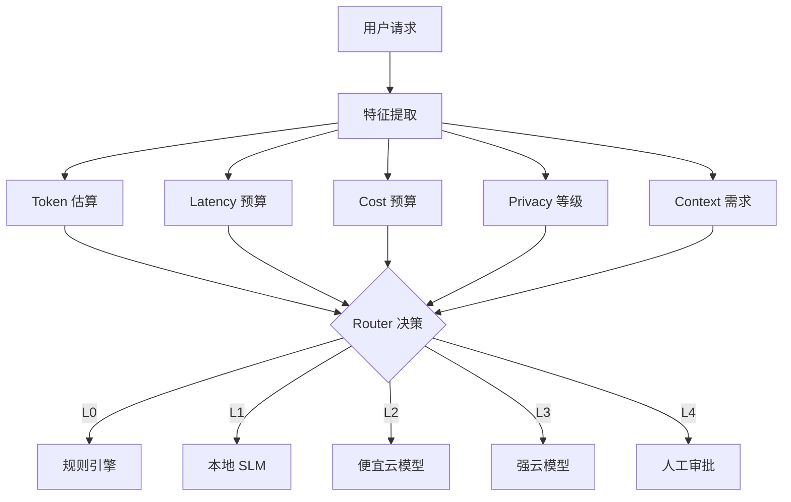
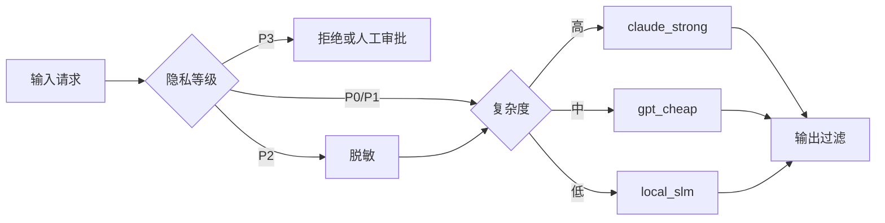

# 第 10 章：SLM Router 与模型分级路由

SLM Router 负责在多个模型和执行环境之间做选择。它的目标不是永远选择最强模型，而是在满足质量要求的前提下，尽量降低延迟、成本和隐私风险。

## 1. 概念讲解

在 Agent 系统中，不同请求对模型能力的要求差异很大：

- 「打开客厅灯」不需要云端大模型。
- 「总结这份 30 页合同的风险」需要长上下文和强推理能力。
- 「我的身份证号是……帮我填表」包含高隐私数据，应谨慎上云。
- 「帮我写一份融资路演稿」需要更高质量的生成能力。

SLM Router 通过规则、分类模型或小语言模型，对请求进行评分，然后选择合适模型。

常见模型层级：

| 层级 | 示例 | 特点 | 适合任务 |
| --- | --- | --- | --- |
| L0 | 规则引擎 | 极低成本、确定性强 | 唤醒词、固定命令、黑白名单 |
| L1 | 本地 SLM | 低延迟、隐私友好 | 简单意图、短文本改写、本地动作 |
| L2 | 便宜云模型 | 成本适中、能力更强 | 普通知识问答、摘要、轻量工具调用 |
| L3 | 强云模型 | 成本高、质量高 | 复杂推理、长上下文、多步骤规划 |
| L4 | 人工审批 | 可靠但慢 | 高风险动作、合规审查、异常兜底 |

## 2. Mermaid 架构图



## 3. Router 决策维度

### 3.1 Token

Token 决定上下文长度和调用成本。Router 应估算：

- 用户输入长度。
- 检索上下文长度。
- 工具结果长度。
- 预期输出长度。

如果输入很短且无需外部知识，优先本地或便宜模型；如果需要处理长文档，则需要支持长上下文的云模型。

### 3.2 Latency

不同任务的延迟容忍度不同：

- 语音打断、开关设备：要求非常低延迟。
- 文档总结：可以等待数秒。
- 批量报告生成：可以异步执行。

Router 可以根据 `latency_budget_ms` 过滤不可接受的模型。

### 3.3 Cost

成本不只是单次调用价格，还包括：

- 输入 Token。
- 输出 Token。
- 工具调用费用。
- Embedding 和检索费用。
- 重试和失败成本。

生产系统应设置用户级、租户级和任务级预算。

### 3.4 Privacy

隐私等级通常高于成本和质量：

- P0：公开信息，可上云。
- P1：内部信息，可发送到企业云模型。
- P2：个人敏感信息，需要脱敏或本地处理。
- P3：高度敏感信息，拒绝上云或需要审批。

Router 必须在模型调用前完成隐私检测。

### 3.5 Context

上下文需求包括：

- 是否需要历史对话。
- 是否需要 RAG 检索。
- 是否需要工具结果。
- 是否需要长文档。
- 是否需要多模态输入。

本地 SLM 通常不适合长上下文和复杂工具链。

## 4. 模型分级路由示例



一个简化规则：

```text
if privacy == "high":
    route = "local_slm"
elif complexity >= 8 or context_tokens > 8000:
    route = "claude_strong"
elif cost_budget < 0.01:
    route = "local_slm"
else:
    route = "gpt_cheap"
```

在真实系统中，这些规则可以由策略引擎、在线学习模型或 A/B 实验持续优化。

## 5. 设计要点

1. **先做硬约束过滤**：隐私、权限、延迟上限属于硬约束。
2. **再做软目标优化**：在可选模型中优化成本和质量。
3. **保留决策解释**：每次路由都记录为什么选择该模型。
4. **支持降级**：强模型不可用时，返回简化答案或排队异步处理。
5. **在线评估**：收集用户反馈、重试率、人工接管率和成本数据。
6. **避免单点策略**：规则、分类器和人工策略可以组合使用。
7. **定期校准**：模型价格、延迟和能力变化后，路由策略也要更新。

## 6. 代码实例说明

配套示例位于：

```text
examples/09-slm-router/main.py
```

该示例展示：

- 如何根据隐私关键词打分。
- 如何根据长度和复杂词估算复杂度。
- 如何根据预算选择不同 Mock 模型。
- 如何输出路由原因，方便调试和审计。

运行方式：

```bash
cd examples/09-slm-router
python main.py
```

## 7. 练习题

1. 把 Router 的规则改成可配置 JSON 文件。
2. 增加 `context_tokens` 输入，并在超过阈值时选择长上下文模型。
3. 为每个模型设置最大并发数，超过后自动降级。
4. 根据历史成功率调整模型优先级。
5. 思考：Router 错误选择便宜模型导致回答质量差，如何自动重试升级？
