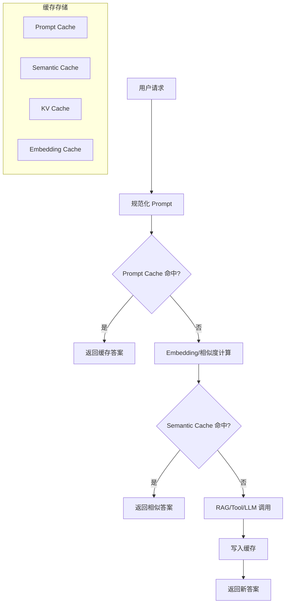

# 第 11 章：Agent 缓存与降本策略

缓存是 AI Agent 规模化落地时最重要的工程手段之一。它可以降低 Token 成本、减少延迟、提升稳定性，并在模型服务抖动时提供兜底能力。

## 1. 概念讲解

传统 Web 系统缓存的是数据库查询结果、页面片段或静态资源。AI Agent 的缓存对象更丰富：

- Prompt 级缓存。
- 语义相似问题缓存。
- 检索结果缓存。
- Embedding 缓存。
- 工具调用结果缓存。
- KV Cache。
- 模型输出缓存。

缓存设计的难点在于：LLM 输出具有不确定性，同一个问题可能因为上下文、时间、用户权限不同而得到不同答案。因此，缓存键必须包含影响结果的关键因素。

## 2. Mermaid 架构图



## 3. Prompt Cache

Prompt Cache 使用精确键匹配：

```text
cache_key = hash(model + system_prompt + user_prompt + tool_version + tenant_id)
```

适合：

- FAQ。
- 固定模板生成。
- 稳定知识问答。
- 低风险重复请求。

优点：

- 实现简单。
- 命中结果确定。
- 不需要向量数据库。

缺点：

- 对措辞变化敏感。
- 对动态数据必须谨慎。

设计建议：

- 对输入做规范化，例如去除多余空格、统一大小写。
- 缓存键包含模型版本和 Prompt 模板版本。
- 给动态答案设置较短 TTL。

## 4. Semantic Cache

Semantic Cache 根据语义相似度命中，而不是完全相同的文本。例如：

- 「北京天气怎么样？」
- 「帮我查一下北京现在的天气」

两者语义接近，可以复用答案或复用部分中间结果。

常见实现：

1. 为请求生成 Embedding。
2. 在向量库中查找相似请求。
3. 相似度超过阈值时返回缓存结果。
4. 未命中时调用模型并写入缓存。

风险：

- 相似但不等价的问题可能误命中。
- 用户权限不同可能导致数据泄露。
- 时间敏感问题容易过期。

因此，Semantic Cache 应用于低风险场景，并结合 TTL、租户隔离和权限标签。

## 5. Redis Cache

Redis 常用于线上缓存层：

- 低延迟读写。
- 支持 TTL。
- 支持 Hash、Set、Sorted Set 等结构。
- 适合分布式服务共享缓存。

典型用法：

- Prompt Cache：`GET prompt:{hash}`。
- Tool Result Cache：`GET tool:{tool_name}:{args_hash}`。
- Rate Limit：`INCR rate:{user_id}:{minute}`。
- Session State：`HSET session:{id}`。

注意事项：

- 缓存值不要存明文敏感数据。
- 大对象要压缩或存对象存储。
- Redis 故障时系统应能降级到直接调用模型。

## 6. Embedding Cache

Embedding 也有成本，尤其是在高 QPS 检索系统中。Embedding Cache 的键通常是：

```text
hash(embedding_model + normalized_text)
```

适合缓存：

- 用户问题向量。
- 文档块向量。
- 工具描述向量。
- FAQ 向量。

当 Embedding 模型升级时，需要重新计算或使用模型版本隔离缓存。

## 7. KV Cache

KV Cache 是 Transformer 推理中的底层优化，用于缓存 Attention 的 Key/Value 张量，减少重复计算。

在应用层需要理解它的影响：

- 长上下文连续对话可以复用前缀计算。
- 流式生成更依赖 KV Cache。
- 模型服务端可能提供 Prompt Prefix Cache。
- KV Cache 占用显存，需要淘汰策略。

应用开发者通常不直接操作 KV Cache，但可以通过稳定系统 Prompt、减少无效上下文变化来提高服务端缓存命中率。

## 8. 降本策略

1. **请求规范化**：提升 Prompt Cache 命中率。
2. **模型分级路由**：简单请求不走强模型。
3. **结果缓存**：对稳定问题缓存最终答案。
4. **中间结果缓存**：缓存检索、工具和 Embedding。
5. **上下文裁剪**：只传必要历史和检索片段。
6. **批处理**：离线任务合并调用。
7. **流控和配额**：限制异常用户或异常 Agent 循环。
8. **失败降级**：模型失败时返回缓存答案并提示更新时间。

## 9. 设计要点

1. **缓存键包含所有关键上下文**：用户、租户、权限、模型、模板版本。
2. **TTL 按数据新鲜度设置**：天气、库存、价格等短 TTL；静态知识长 TTL。
3. **权限隔离优先**：不同用户的私有数据不能共享语义缓存。
4. **命中要可解释**：记录命中类型、相似度和节省成本。
5. **误命中可回滚**：用户反馈错误时应删除或降低缓存权重。
6. **缓存不是唯一真相**：关键业务动作仍应查询权威系统。

## 10. 代码实例说明

配套示例位于：

```text
examples/10-cache/main.py
```

示例包含：

- Prompt Cache：规范化字符串后精确命中。
- Semantic Cache：使用标准库计算字符串相似度，无需向量库。
- 成本统计：展示命中后节省的 Mock Token 成本。
- 真实 Redis/Embedding 开关说明，默认本地运行。

运行方式：

```bash
cd examples/10-cache
python main.py
```

## 11. 练习题

1. 给 Prompt Cache 增加 TTL。
2. 把 Semantic Cache 的相似度阈值改为可配置参数。
3. 在缓存键中加入 `tenant_id`，模拟多租户隔离。
4. 增加工具结果缓存，例如缓存天气查询结果 60 秒。
5. 思考：哪些类型的问题不适合做 Semantic Cache？
